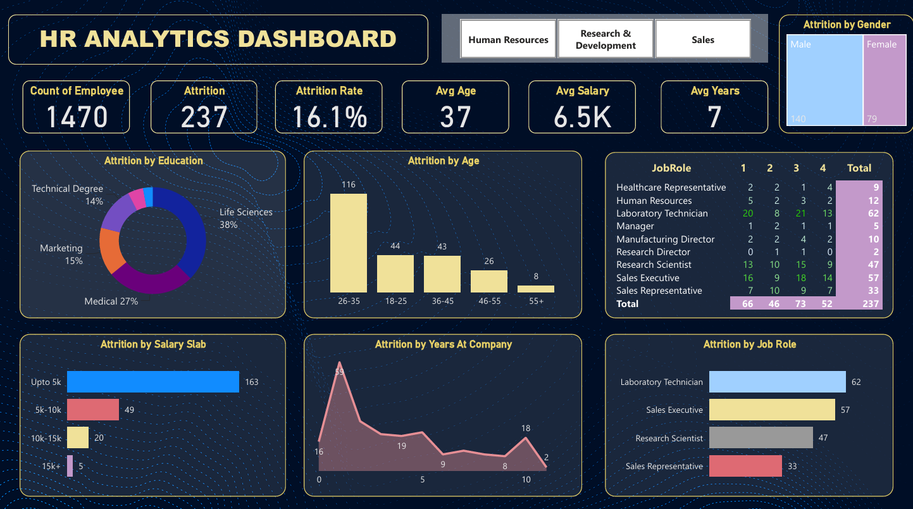

# 📊 HR Analytics Dashboard using Power BI

An interactive HR Analytics Dashboard developed in **Power BI** to analyze employee attrition and workforce trends. The dashboard provides valuable insights into employee demographics, job roles, salary distribution, and attrition patterns, helping HR teams make data-driven decisions.

---

## 📌 Project Overview

Employee attrition is a key challenge for organizations, affecting productivity, recruitment costs, and overall business performance. This dashboard presents important HR metrics and visualizations that help identify trends and factors contributing to employee turnover.

The report is fully interactive, allowing users to filter data by department and explore insights through dynamic visualizations.

---

## 🎯 Project Objectives

- Analyze employee attrition trends.
- Monitor key HR performance indicators (KPIs).
- Identify departments and job roles with the highest attrition.
- Analyze attrition based on age, education, salary, and years at the company.
- Build an interactive dashboard to support HR decision-making.

---

## 🛠️ Tool Used

## Dashboard Preview

---

## 📊 Dashboard KPIs

- 👥 Total Employees: **1470**
- 🚪 Total Attrition: **237**
- 📉 Attrition Rate: **16.1%**
- 🎂 Average Age: **37 Years**
- 💰 Average Salary: **6.5K**
- ⏳ Average Years at Company: **7 Years**

---

## 📈 Dashboard Visualizations

The dashboard includes the following interactive visualizations:

- Attrition by Education
- Attrition by Age Group
- Attrition by Gender
- Attrition by Salary Slab
- Attrition by Years at Company
- Attrition by Job Role
- Department Filter (HR, Research & Development, Sales)
- Interactive KPI Cards

---

## 📷 Dashboard Preview

> *(Replace the image below with your dashboard screenshot.)*

---

## 💡 Key Insights

- The overall employee attrition rate is **16.1%**.
- Employees aged **26–35 years** have the highest attrition.
- Laboratory Technicians experience the highest employee turnover.
- Employees earning **up to 5K** have the highest attrition.
- Most employees leave during the early years of employment.
- Male employees account for a higher share of attrition.
- The Life Sciences education field has the highest attrition.

---

## 📂 Repository Contents

| File | Description |
|------|-------------|
| `HR_Analytics_Dashboard.pbix` | Power BI dashboard file |
| `dashboard.png` | Dashboard screenshot |
| `HR_Analytics_Report.pdf` | Detailed project report |
| `dataset.csv` | Dataset used in the project |
| `README.md` | Project documentation |

---

## 🚀 Features

- Interactive dashboard
- Department-wise filtering
- Dynamic KPI cards
- Business-focused visualizations
- Easy-to-understand layout
- Interactive cross-filtering

---

## 📌 Business Benefits

This dashboard helps HR professionals:

- Monitor employee attrition.
- Identify workforce trends.
- Analyze employee turnover.
- Support data-driven HR decisions.
- Improve employee retention strategies.

---

## 📚 Skills Demonstrated

- Power BI
- Dashboard Development
- Data Visualization
- DAX Measures
- KPI Design
- Interactive Reporting
- HR Analytics
- Business Intelligence

---

## 👤 Author

**Ramesh Chulbule**

If you found this project helpful, feel free to ⭐ the repository.
